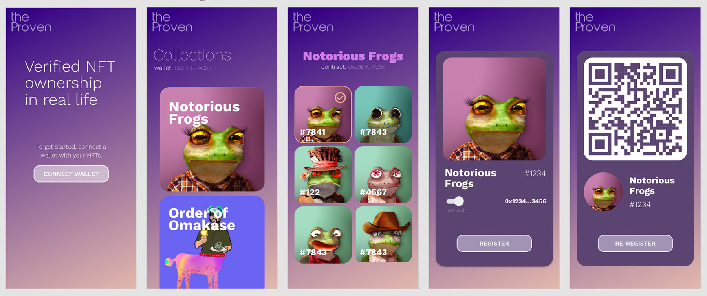

# TheProven
## Validate NFT ownership in real life

How do we prove we hold an NFT in a real life context? How can we prove ownership without carrying valuable NFTs in a hot wallet?

TheProven is a proof of concept to solve these problems using a set of tools to prove ownership of NFTs in real life. The system has multiple parts including a set of smart contracts, a client dApp for holders, and a client dApp for validators.

NFT holders can register their NFTs on chain. They can then move them to safe storage off chain. The record of their ownership is kept in TheProven smart contract.

NFT verifiers, or those looking to verify holders, scan the QR code of individual registrations to prove ownership. Holders are also required to sign a message from their wallet to complete verification.

This is a workmin progress...